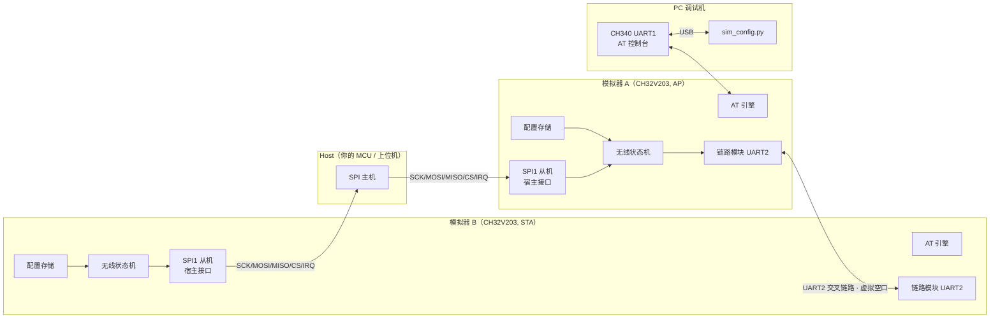
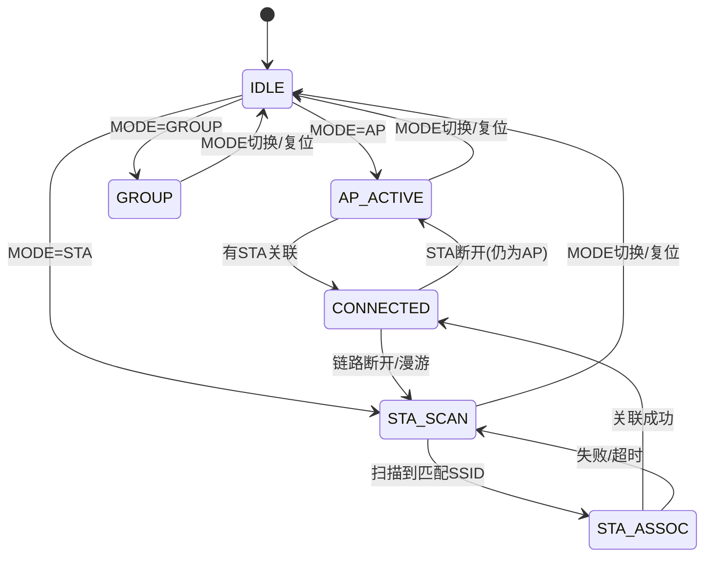

# 总体架构

本文描述 TXW8301 模拟器（CH32V203）的总体架构、数据通路与模块划分。
文档面向：想了解模拟器如何工作、想扩展/移植、或想在其上做 host 侧开发的人。

## 1. 设计目标与边界

模拟器**不是**指令集仿真器，而是**行为级模拟器**：它从"宿主（host）"的角度，
模拟一颗 TXW8301 HaLow 模块的**外部行为**，包括：

1. **AT 命令**：与真实模块相同的 AT 命令集与响应格式（`OK` / `ERROR` / `+XXX` 事件）。
2. **无线状态机**：AP / STA / APSTA / GROUP 工作模式、扫描/关联/连接、配对、漫游开关。
3. **链路指标**：可配置/可注入的 RSSI、连接状态、STA 数。
4. **数据通路**：host 经 SPI 下发/上收的以太网帧，通过"虚拟空口"转发到对端模拟器。

**不模拟**：802.11ah PHY/MAC 空中帧、真正的射频调制解调、加密算法（WPA-PSK 仅做参数
校验与"是否加密"标记，不做真实加解密，便于调试）。

## 2. 系统框图



## 3. 模块划分（固件侧）

| 模块 | 文件 | 职责 |
|------|------|------|
| 主程序 | `Core/main.c` | 硬件初始化、主循环调度、事件分发 |
| 板级定义 | `Core/board.h` | 引脚映射、外设基地址、宏开关 |
| GPIO 驱动 | `Periph/gpio.c` | 引脚模式/电平（LED、按键、拨码、IRQ） |
| UART 驱动 | `Periph/uart.c` | UART1 控制台、UART2 链路，中断收发 |
| SPI 从机 | `Periph/spi_slave.c` | SPI1 从机 + 帧协议 + IRQ 通知（见 spi_protocol.md） |
| 配置存储 | `Simulator/sim_cfg.c` | 模拟 syscfg：模式/SSID/PSK/信道等，FLASH 掉电保存 |
| 无线状态机 | `Simulator/sim_wifi.c` | AP/STA/APSTA/GROUP 状态机、配对、RSSI 模型、事件上报 |
| AT 引擎 | `Simulator/sim_at.c` | AT 解析与命令表（大小写不敏感、`?` 查询） |
| 虚拟空口 | `Simulator/sim_link.c` | UART2 链路：组帧/解帧/CRC，转发数据帧与信令 |
| 指示/输入 | `Simulator/sim_led.c` | CONN 灯、RSSI 灯、按键/拨码处理 |

## 4. 数据通路（两次转发）

模拟器的"桥"语义与 T-Halow-RJ45 的 **RJ45↔HaLow 二层透明桥**等价，只是把
"RJ45/PHY"换成了 **SPI 宿主接口**、"HaLow 空口"换成了 **UART 虚拟空口**：

```
Host A --SPI DATA_TX(以太网帧)--> 模拟器A[SPI从机]
      --> 模拟器A[无线状态机: 查目的/广播，打虚拟空口帧头]
      --> UART2 --帧--> 模拟器B[链路模块]
      --> 模拟器B[无线状态机: 查是否本机/广播]
      --> 模拟器B[SPI从机: 置IRQ, 缓存RX帧]
      --> Host B --SPI DATA_RX(以太网帧)--> 收到
```

- **单播**：按目的 MAC（`AT+MAC_ADDR` / 学习表）定向到某台对端。
- **广播/组播**：`ff:ff:ff:ff:ff:ff` 或组播地址（`AT+JOINGROUP`）广播到链路上所有在线对端。
- 帧携带 14 字节以太网头 + 载荷，与 `AT+TXDATA` 描述一致（长度含以太网头）。

## 5. 事件上报（异步）

模拟器在以下时机主动向 host / 控制台发送事件（`+XXX`），与真实模块一致：

| 事件 | 触发时机 |
|------|----------|
| `+CONNECTED` | STA 关联成功 / AP 有 STA 接入 |
| `+DISCONNECTED` | 链路断开 |
| `+PAIR SUCCESS` | 配对成功 |
| `+RSSI` | RSSI 变化上报（周期或变化触发） |
| `+WNB` 统计 | `AT+SYSDBG=WNB,1` 时周期性输出网络层统计 |

- 控制台（UART1）直接打印；SPI 侧通过 `EVENT` 帧 + `IRQ` 脚通知 host 读取。

## 6. 状态机（sim_wifi）



- **STA**：按 `AT+CHAN_LIST`（或 `AT+FREQ_RANGE`）周期"扫描"；与对端 AP 的
  SSID/加密/信道匹配即进入关联，模拟关联成功（可配失败概率）。
- **AP**：开启"beacon"周期；有 STA 的关联请求（虚拟空口信令帧）即接纳并进入
  `CONNECTED`，`AT+RSSI=1` 返回该 STA 的模拟 RSSI。
- **配对**：`AT+PAIR=1` 双方进入配对态；AP 生成/下发随机 PSK（若 STA 未配置），
  成功后上报 `+PAIR SUCCESS`，`AT+PAIR=0` 停止并自动建立连接。

## 7. 关键设计决策

1. **SPI 作为宿主总线**：对应 SDK 的 `MACBUS_SPI`（`mac_bus_spi_attach`）。CH32V203
   无 SDIO 主机/从机，SPI 从机是成本与可行性最优解。
2. **UART 作为虚拟空口**：两片模拟器只需 3 根线（TX/RX/GND）即可对连，最简复现
   AP↔STA 场景；协议自带长度+CRC，抗串口噪声。
3. **8MHz HSI 主频、无 PLL**：最小化时钟配置风险；模拟器不追求算力，
   SPI 从机速率、UART 波特率均满足需求。可在 `board.h` 中切换到 96MHz PLL。
4. **无操作系统**：裸机前后台（主循环 + 中断），无 malloc，全部静态缓冲，
   逻辑清晰、便于单步调试，也便于移植到 RTOS。

## 8. 扩展方向

- 接入更多虚拟 STA/AP 的数量统计、干扰/丢包注入（模拟弱信号、碰撞）。
- 把虚拟空口换成 TCP/UDP（两块板子各接一个 USB-TTL，由 PC 中继），可跨房间联调。
- WPA-PSK 真实加解密（移植 AES/CCMP）以更贴近真实协议。
- 增加串口日志等级与抓包（帧内容 hex dump）便于协议分析。
