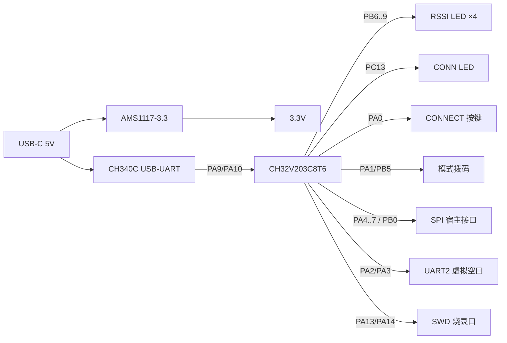

# 硬件设计

模拟器硬件围绕 **CH32V203C8T6（LQFP48, 64KB Flash / 20KB RAM）** 搭建，
无以太网、无射频，成本最低。整体接口：SPI 宿主口 + UART AT 控制台（CH340C/USB-C）+
UART 虚拟空口 + LED/按键/拨码 + SWD 烧录。

> 注意：CH32V203 **无 SDIO**，SPI 从机是宿主总线的现实选择（TXW8301 SDK 亦支持
> `MACBUS_SPI`）。若日后需要 RMII 以太网（WNB 桥场景），应换 CH32V208/CH32V307。

> Fritzing：自定义元件 `hardware/parts/*.fzpz` 可直接导入 Fritzing；
> 原理图组装步骤见 [docs/Fritzing_Build_Guide.md](Fritzing_Build_Guide.md)。

## 1. 原理框图



## 2. 引脚分配（board.h 与之对应）

| 功能 | 引脚 | 方向 | 说明 |
|------|------|------|------|
| UART1_TX（AT 控制台） | PA9 | 输出 | → CH340C RXD |
| UART1_RX（AT 控制台） | PA10 | 输入 | ← CH340C TXD |
| UART2_TX（虚拟空口） | PA2 | 输出 | → 对端模拟器 RX |
| UART2_RX（虚拟空口） | PA3 | 输入 | ← 对端模拟器 TX |
| SPI1_NSS | PA4 | 输入 | SPI 片选（低有效，硬件 NSS） |
| SPI1_SCK | PA5 | 输入 | SPI 时钟 |
| SPI1_MISO | PA6 | 输出 | 模拟器数据出 |
| SPI1_MOSI | PA7 | 输入 | 模拟器数据入 |
| IRQ（数据就绪） | PB0 | 输出 | 高有效，host 读取后自动拉低 |
| CONN 灯 | PC13 | 输出 | 低有效（板上 LED 接 3.3V 经限流电阻） |
| RSSI 灯 0~3 | PB6 PB7 PB8 PB9 | 输出 | 高有效 |
| CONNECT/PAIR 按键 | PA0 | 输入上拉 | 按下为低 |
| 模式拨码 bit0 | PA1 | 输入上拉 | 00=AP 01=STA 10=GROUP 11=APSTA |
| 模式拨码 bit1 | PB5 | 输入上拉 | 同上 |
| SWDIO / SWCLK | PA13 / PA14 | - | WCH-Link 烧录调试 |
| NRST | NRST | - | 复位（配 RC + 按键） |
| BOOT0 | BOOT0 | 输入 | 10k 下拉 + 跳线 |

## 3. 电源

- **输入**：USB-C 5V（数据脚给 CH340C 的 UD+/UD-；VBUS 经 LDO 供 3.3V）。
- **LDO**：AMS1117-3.3（SOT223），输入 5V，输出 3.3V；C_in=10µF+100nF，C_out=10µF+100nF。
- **核/IO 电压**：3.3V（VDDA=3.3V，VSSA 接地，VCAP 引脚对地 0.1µF——务必接）。
- 所有电源引脚就近 100nF 去耦。

## 4. 时钟

- 默认用 **HSI 8MHz**（无需晶振也能跑，最简）。
- 板上预留 8MHz 晶振（PA8/PC14 为 OSC_IN/OSC_OUT——注意 **PC14/PC15 是 OSC32**，
  CH32V203 的 OSC 引脚是 **PA8/PD1**，预留封装但不贴，默认走 HSI）。
- 如需精确波特率/更高主频，改 `board.h` 中 `BOARD_USE_HSE_PLL` 为 1。

## 5. 关键外设电路

- **CH340C**（SOP16，内置 USB 收发、自带晶振）：
  - UD+/UD- → USB-C；V3(3.3V 内部输出) → 接 100nF，可给 3.3V 供电；
  - TXD→PA10，RXD←PA9；RTS/DTR 可选用于控制 NRST/BOOT0（自动下载，本项目用 SWD，不需要）。
- **SPI 宿主口**：5P 排针（SCK/MOSI/MISO/NSS/IRQ）+ 3.3V/GND。建议接 ESD 保护。
- **LED**：CONN 接 PC13（低有效），RSSI×4 接 PB6~PB9（高有效），限流 1k。
- **按键**：CONNECT 接 PA0→GND（内部上拉）；复位接 NRST。
- **模式拨码**：2-bit DIP，一端接 PA1/PB5，另一端接 GND（内部上拉，拨到 ON=低）。

## 6. 接线（若先搭面包板/洞洞板）

无 PCB 时按如下连接（逻辑连接）：

```
CH340C:  RXD→PA9   TXD→PA10   GND→GND   V3→3.3V    (USB 接 PC)
CH32V203 最小系统: VCAP→100nF→GND;  BOOT0→10k→GND;  NRST→100nF→GND + 按键→3.3V
SPI 宿主: PA4←NSS  PA5←SCK  PA6→MISO  PA7←MOSI  PB0→IRQ   共地
UART 虚拟空口(两板): A.PA2→B.PA3   A.PA3→B.PA2   共地
LED:      PC13→1k→3.3V(CONN,低亮)   PB6/7/8/9→1k→LED→GND
按键:     PA0→GND(内部上拉)          拨码: PA1/PB5→DIP→GND(内部上拉)
SWD:      PA13(→WCH-Link SWDIO)  PA14(→SWCLK)  3.3V  GND
```

## 7. 机械/外壳

参考 T-Halow-RJ45 外形（长方体盒子 + 顶部按钮 + 侧面接口）：
RJ45 位置替换为 SPI 宿主排针/插座，USB-C 保留，拨码与 CONNECT 键布置在正面，
RSSI 灯条布置在侧面。

## 8. 已知取舍

- **10M/100M 以太网**：CH32V203 无以太网 MAC，故数据通路在 SPI 侧而非 RJ45；
  若必须 RJ45，选 CH32V208（10M 内置 MAC+PHY，无需外部 PHY）或 CH32V307（100M，需 LAN8720）。
- **PCB 版**：Fritzing 适合原型验证；量产建议用 KiCad 重建（封装库更全、可出 Gerber/立创下单）。
