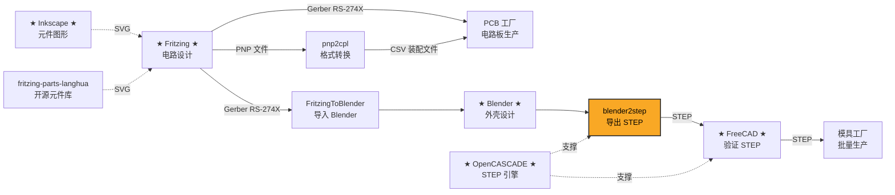

# 项目工具链（blender2step 工作流）

本项目硬件设计采用 **blender2step** 工具链（来源：
[langhua/blender2step](https://github.com/langhua/blender2step)），
这也是选用 **Fritzing**（而非 KiCad）的原因：Fritzing 能直接喂给 Blender 做 3D 外壳设计。

## 对本项目的含义

| 环节 | 本项目产出 |
|------|-----------|
| Fritzing 电路设计 | `fritzing-parts-langhua/fzpz/*.fzpz`（自定义元件）+ `docs/Fritzing_Build_Guide.md`（netlist），在 Fritzing 中组装原理图 |
| Gerber / PNP | 在 Fritzing PCB 视图完成布局后导出 Gerber(RS-274X) + PNP 文件 → PCB 工厂 |
| pnp2cpl | PNP 经 `pnp2cpl` 转 CSV 装配文件 → 贴片 |
| FritzingToBlender | Gerber 导入 Blender → 设计外壳 |
| blender2step | Blender 导出 STEP |
| FreeCAD 验证 | 打开 STEP 验证装配/干涉 → 模具工厂批量生产 |
| 配套元件 | 优先复用 `fritzing-parts-langhua` 元件库风格；Inkscape 绘制 SVG 元件图形 |

> 注意：Fritzing 的 PCB 视图对 LQFP48 + 0603 密排支持有限，适合原型；
> 若量产 PCB 需要更高密度走线/覆铜，可另用 KiCad 重建（原理图/网络表已在
> `docs/hardware.md` 与 `docs/Fritzing_Build_Guide.md` 给出）。
