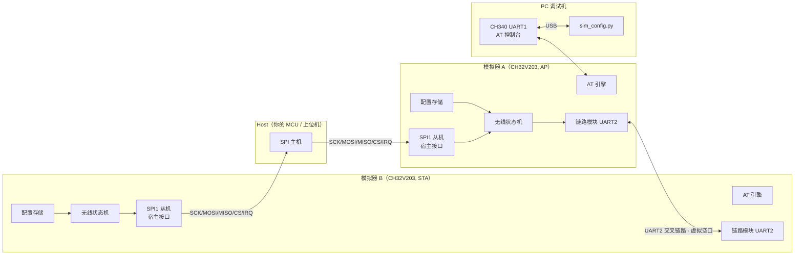
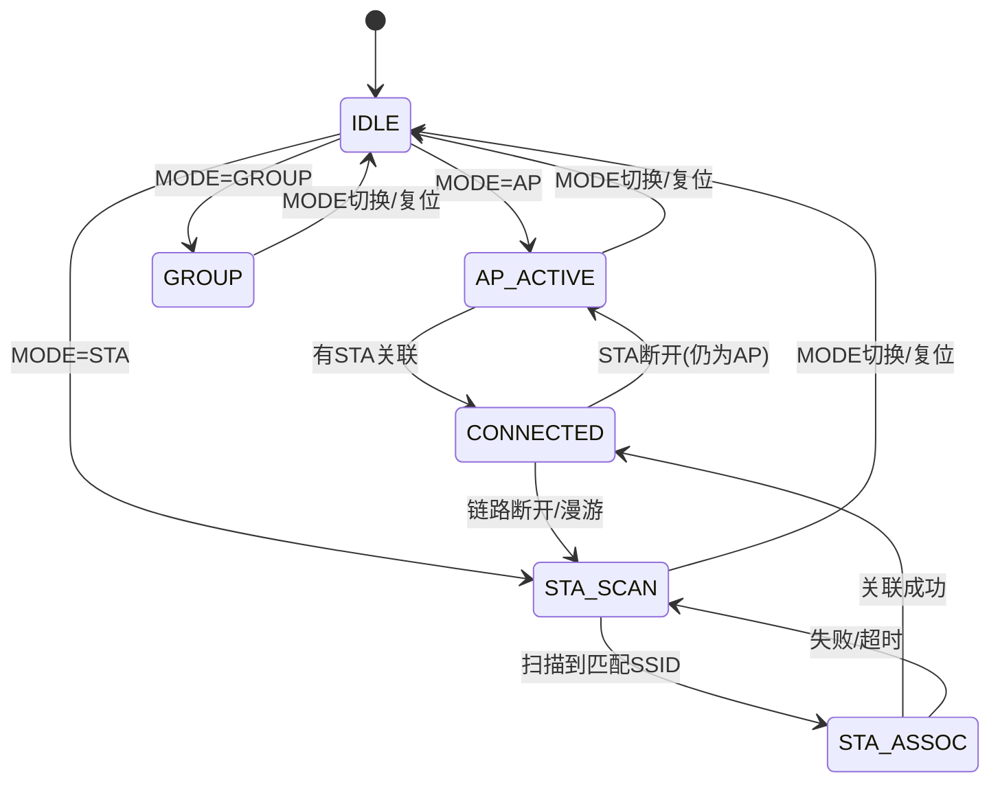

# 总体架构

本文描述 TXW8301 模拟器（CH32V203）的总体架构、数据通路与模块划分。
文档面向：想了解模拟器如何工作、想扩展/移植、或想在其上做 host 侧开发的人。

## 1. 设计目标与边界

模拟器**不是**指令集仿真器，而是**行为级模拟器**：它从"宿主（host）"的角度，
模拟一颗 TXW8301 HaLow 模块的**外部行为**，包括：

1. **AT 命令**：与真实模块相同的 AT 命令集与响应格式（`OK` / `ERROR` / `+XXX` 事件）。
2. **无线状态机**：AP / STA / APSTA / GROUP 工作模式、扫描/关联/连接、配对、漫游开关。
3. **链路指标**：可配置/可注入的 RSSI、连接状态、STA 数。
4. **数据通路**：host 经 SPI 下发/上收的以太网帧，通过"虚拟空口"转发到对端模拟器。
5. **host 数据口**（仅 PC 模拟器）：把上面的数据通路开放给上层程序（TCP，语义对齐 SPI
   MACBUS 的 DATA_TX/DATA_RX）—— 见 [host_port.md](host_port.md)。
6. **行为模型**（均为模拟器扩展、默认全关，见 [backlog.md](backlog.md) 「已做」区）：
   RSSI 距离/功率模型（`AT+DIST`/`AT+TXPOWER`）、丢包注入（`AT+LOSS`）、关联失败概率
   （`AT+ASSOC_FAIL`）、RAW 接入窗口（`AT+RAW`）、TWT 唤醒窗口（`AT+TWT`）。

> **边界仍旧不变**：这些是**行为级近似**，不是 802.11ah PHY/MAC 时序。窗口只约束
> **数据帧**（控制帧不受影响），且优先级/退避/重传/分片都没有建模 —— 需要那类保真度
> 时应上真实硬件（或另做 PHY 层模拟），不在这里加“看上去像真的”的逻辑。

**不模拟**：802.11ah PHY/MAC 空中帧、真正的射频调制解调、加密算法（WPA-PSK 仅做参数
校验与"是否加密"标记，不做真实加解密，便于调试）。

## 2. 系统框图



## 3. 模块划分（固件侧）

| 模块 | 文件 | 职责 |
|------|------|------|
| 主程序 | `Core/main.c` | 硬件初始化、主循环调度、事件分发 |
| 板级定义 | `Core/board.h` | 引脚映射、外设基地址、宏开关 |
| GPIO 驱动 | `Periph/gpio.c` | 引脚模式/电平（LED、按键、拨码、IRQ） |
| UART 驱动 | `Periph/uart.c` | UART1 控制台、UART2 链路，中断收发 |
| SPI 从机 | `Periph/spi_slave.c` | SPI1 从机 + 帧协议 + IRQ 通知（见 spi_protocol.md） |
| 配置存储 | `Simulator/sim_cfg.c` | 模拟 syscfg：模式/SSID/PSK/信道等，FLASH 掉电保存 |
| 无线状态机 | `Simulator/sim_wifi.c` | AP/STA/APSTA/GROUP 状态机、配对、RSSI 模型、事件上报 |
| AT 引擎 | `Simulator/sim_at.c` | AT 解析与命令表（大小写不敏感、`?` 查询） |
| 虚拟空口 | `Simulator/sim_link.c` | UART2 链路：组帧/解帧/CRC，转发数据帧与信令 |
| 指示/输入 | `Simulator/sim_led.c` | CONN 灯、RSSI 灯、按键/拨码处理 |

## 4. 数据通路（两次转发）

模拟器的"桥"语义与 T-Halow-RJ45 的 **RJ45↔HaLow 二层透明桥**等价，只是把
"RJ45/PHY"换成了 **SPI 宿主接口**、"HaLow 空口"换成了 **UART 虚拟空口**：

```
Host A --SPI DATA_TX(以太网帧)--> 模拟器A[SPI从机]
      --> 模拟器A[无线状态机: 查目的/广播，打虚拟空口帧头]
      --> UART2 --帧--> 模拟器B[链路模块]
      --> 模拟器B[无线状态机: 查是否本机/广播]
      --> 模拟器B[SPI从机: 置IRQ, 缓存RX帧]
      --> Host B --SPI DATA_RX(以太网帧)--> 收到
```

- **单播**：按目的 MAC（`AT+MAC_ADDR` / 学习表）定向到某台对端。
- **广播/组播**：`ff:ff:ff:ff:ff:ff` 或组播地址（`AT+JOINGROUP`）广播到链路上所有在线对端。
- 帧携带 14 字节以太网头 + 载荷，与 `AT+TXDATA` 描述一致（长度含以太网头）。

### 4.1 PC 模拟器的 host 数据口

固件侧的 host 是 SPI 主设备；PC 模拟器没有 SPI，于是另外开一个 **TCP 数据口**给
上层程序（`host/sim.py --host <port>`，或 `Core(..., host_port=...)`）：

```
上层程序 --TCP(AA 55 TYPE LEN CRC + 以太网帧)--> 模拟器 host 口 --> Wifi.send_data --> 空口
上层程序 <--TCP(同格式)--------------------- 模拟器 host 口 <-- Wifi.handle_frame(命中本机/广播) <-- 空口
```

帧格式与空口帧**同构**，方向语义与 SPI 的 DATA_TX/DATA_RX 对齐 —— 将来换真实 SPI，
上层程序只需换底层收发。细节（含「哪些帧会被丢弃」）见 [host_port.md](host_port.md)。

## 5. 事件上报（异步）

模拟器在以下时机主动向 host / 控制台发送事件（`+XXX`），与真实模块一致：

| 事件 | 触发时机 |
|------|----------|
| `+CONNECTED` | STA 关联成功 / AP 有 STA 接入 |
| `+DISCONNECTED` | 链路断开 |
| `+PAIR SUCCESS` | 配对成功 |
| `+RSSI` | RSSI 变化上报（周期或变化触发） |
| `+WNB` 统计 | `AT+SYSDBG=WNB,1` 时周期性输出网络层统计 |

- 控制台（UART1）直接打印；SPI 侧通过 `EVENT` 帧 + `IRQ` 脚通知 host 读取。

## 6. 状态机（sim_wifi）



- **STA**：按 `AT+CHAN_LIST`（或 `AT+FREQ_RANGE`）周期"扫描"；与对端 AP 的
  SSID/加密/信道匹配即进入关联，模拟关联成功（可配失败概率 → `AT+ASSOC_FAIL`，见 §8.1）；
  已连接后可选 RAW 接入窗口（`AT+RAW`，只在 AP 上配）与 TWT 唤醒窗口（`AT+TWT`）约束上行数据帧。
- **AP**：开启"beacon"周期；有 STA 的关联请求（虚拟空口信令帧）即接纳并进入
  `CONNECTED`，`AT+RSSI=1` 返回该 STA 的模拟 RSSI。
- **配对**：`AT+PAIR=1` 双方进入配对态；AP 生成/下发随机 PSK（若 STA 未配置），
  成功后上报 `+PAIR SUCCESS`，`AT+PAIR=0` 停止并自动建立连接。

## 7. 关键设计决策

1. **SPI 作为宿主总线**：对应 SDK 的 `MACBUS_SPI`（`mac_bus_spi_attach`）。CH32V203
   无 SDIO 主机/从机，SPI 从机是成本与可行性最优解。
2. **UART 作为虚拟空口**：两片模拟器只需 3 根线（TX/RX/GND）即可对连，最简复现
   AP↔STA 场景；协议自带长度+CRC，抗串口噪声。
3. **8MHz HSI 主频、无 PLL**：最小化时钟配置风险；模拟器不追求算力，
   SPI 从机速率、UART 波特率均满足需求。可在 `board.h` 中切换到 96MHz PLL。
4. **无操作系统**：裸机前后台（主循环 + 中断），无 malloc，全部静态缓冲，
   逻辑清晰、便于单步调试，也便于移植到 RTOS。

## 8. 扩展方向（已收敛到 backlog.md）

原来这里是一串「扩展方向」，现在**逐条结案**了（已做 / 不做附理由 / 留待真机或外部）：
见 **[backlog.md](backlog.md)**。本节只留现状一句：

- **已做**：STA 数量统计、丢包注入、帧抓包（`AT+SYSDBG=WNB,1` + UI 帧监视器）、
  虚拟空口本来就是 TCP/UDP（另有串口空口）；另新增 RSSI 距离模型、关联失败概率、
  RAW 接入窗口、TWT 唤醒窗口。
- **不做**：WPA-PSK 真实加解密、吞吐量建模、射频测试命令、串口日志分级（理由见 backlog）。

### 8.1 行为模型的边界（别把它们当 PHY/MAC 仿真）

上面新增的那些模型都是**行为级近似**，而且**只约束数据帧**：

| 模型 | 配置命令 | 基准 | 没建模的（想要保真度就上真机） |
|---|---|---|---|
| RSSI 距离/功率 | `AT+DIST` / `AT+PATHLOSS` | 对端自报发射功率 − PL(f,d,n) | 衰落/多径/天线增益/与速率相关的灵敏度 |
| 丢包注入 | `AT+LOSS` | 确定性种子随机 | 碰撞、CCA/退避、重传（真 MAC 的补救机制） |
| 关联失败 | `AT+ASSOC_FAIL` | 确定性种子随机 | 认证/密钥失败、AP 满载拒绝 |
| RAW 接入窗口 | `AT+RAW` | 与 beacon 对齐的时隙（只约束 **STA 上行**） | 优先级、AID 分组、跨槽/跨 beacon 的调度 |
| TWT 唤醒窗口 | `AT+TWT` | 与 beacon 对齐的唤醒窗口（只约束 **STA**） | 协商过程（请求/接受/拒绝）、省电计量 |

**控制帧（beacon / assoc / 保活）不受这些窗口约束** —— 否则状态机会被模型自己搞乱
（比如 TWT 间隔一大，AP 直接超时踢掉 STA），那是“模型 bug”而不是“协议行为”。

> 另一个诚实提醒：本模拟器**没有 PHY/MAC 时序**（§1 的「不模拟」），所以这些模型的
> 用处是「把参数变可见、可演示」（例如发射功率/距离怎么影响 RSSI、窗口怎么造成排队），
> **不是**「验证真实空口性能」。
