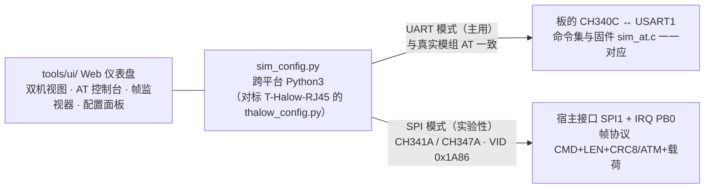

# sim_config.py — TXW8301 模拟器上位机工具

跨平台（Windows / Linux / macOS）Python3 工具，作用类似 T-Halow-RJ45 的
`thalow_config.py`，但面向本模拟器。**UART 模式为主**（与真实模块 AT 一致），
SPI 模式为实验性（验证宿主接口）。

> 想要**图形化界面**？用 `tools/ui/`（Web 仪表盘）：双机视图、AT 控制台、
> 帧监视器、配置面板。见 [ui/README.md](ui/README.md)。

两种模式各自控的是哪条路（GUI 与这个 CLI 在同一侧）：



## 依赖

```bash
pip install pyserial        # UART 模式
pip install pyusb           # SPI 模式（CH341A/CH347A，实验性）
```

## UART 模式（推荐）

```powershell
# 列出串口（板子的 CH340C 显示为 USB-SERIAL）
python sim_config.py list

# 板 A 配 AP，板 B 配 STA（同 SSID/频率/带宽，无加密）
python sim_config.py COM3 ap  --ssid halowlink --freq 9080 --bw 8 --open
python sim_config.py COM4 sta --ssid halowlink --freq 9080 --bw 8 --open

# 查询状态（模式/连接/RSSI/版本/全部配置）
python sim_config.py COM4 status

# 恢复出厂设置
python sim_config.py COM4 reset

# 发送任意 AT
python sim_config.py COM4 at --line "AT+CHAN_LIST=9080,9160"
```

WPA-PSK 时两端设置相同 64 位 hex：
```powershell
python sim_config.py COM3 ap  --ssid mynet --psk <64位hex>
python sim_config.py COM4 sta --ssid mynet --psk <64位hex>
```

## SPI 模式（实验性）

通过 **CH341A / CH347A**（USB-SPI 适配器，VID 0x1A86）走宿主接口帧协议
（`docs/spi_protocol.md`）：

```powershell
python sim_config.py spi status
python sim_config.py spi ping
python sim_config.py spi ap  --ssid halowlink --freq 9080 --bw 8 --open
python sim_config.py spi getstate
```

接线（适配器 ↔ 模拟器 SPI 口）：SCK/MOSI/MISO/CS + GND。
> 注意：CH341A 的 CS 极性（`sim_config.py` 顶部 `SPI_CS_LOW/HIGH`）与端点假设
> 基于 flashrom 的 CH341A 驱动；若你的适配器行为不符，调整这两个常量即可。

### SPI 帧协议层：单一源 + 离线对拍

帧格式（`CMD+LEN+CRC8/ATM+载荷`）原来在本文件与固件 `Periph/spi_slave.c` 里**各写一份**，
两边漂移了不会报错 —— 真机上只表现为「发出去没反应」。 现在：

| 文件 | 是什么 |
|---|---|
| `spi_frame.py` | **主机侧协议模型**（CRC/请求帧/应答帧/应答解析/接收状态机）；`sim_config.py` 从这里 import（不再自己抄一份） |
| `spi_proto_cli.c` | 把**设备侧**协议层（`firmware/Simulator/spi_proto.c`）拿到 PC 上跑的 CLI；**不编进固件** |
| `spi_test_vectors.txt` | 对拍向量（**勿手改**，由 Python 模型生成） |
| `check_spi_proto.py` | 对拍脚本（也是 `run_checks.py` 的一步） |

```powershell
python tools/check_spi_proto.py            # 退出码 0 且 225/225 = 两侧逐字节一致
python tools/check_spi_proto.py --refresh  # 用 Python 模型重生成向量
```

> 本机没主机 C 编译器时**可见跳过**（`[SKIP]`，退出码 2）——跳过 ≠ 通过。
> 它只证**协议层**一致；寄存器/EXTI/真机时序仍待上机（`docs/backlog.md` §三）。

## 说明

- UART 模式发送的 AT 命令与固件 `sim_at.c` 命令集一一对应。
- SPI 模式实现了帧协议（CMD+LEN+CRC8/ATM+载荷），含 `AT_CMD / GET_STATE /
  DATA_TX / DATA_RX / EVENT / PING / RESET / GET_CFG / SET_CFG`。
- `getstate` / `ping` 仅 SPI 模式可用。
