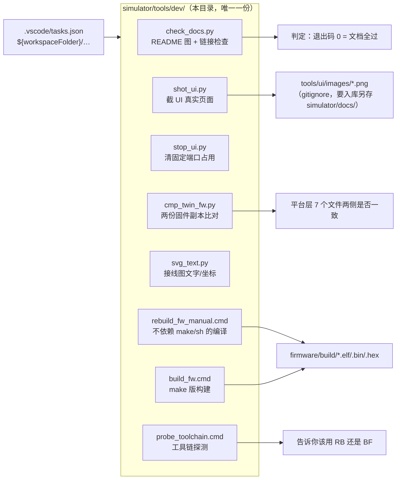

# dev/ — 本机开发/核对用的小工具

这些脚本原来都是**一次性写在 `%TEMP%` 里**、然后被 `.vscode/tasks.json` 用绝对路径调用的 ——
换机器或清一次临时目录就全废（而且路径指向哪儿、脚本干了什么，谁都看不出来）。
现在它们**只有这一份**，放在仓库里、路径全用相对定位（脚本自己从 `__file__` 推仓库根，
`.cmd` 用 `%~dp0`），VS Code 任务也改成 `${workspaceFolder}/simulator/tools/dev/…`。

| 脚本 | 干什么 | 什么时候用 |
|---|---|---|
| `check_docs.py` | 每个 README 是否**有图**（图片/``/mermaid）+ 所有 md 的**相对链接/图片是否真的存在**；`--stats` 出图片数统计，`--inline` 额外提示反引号里的仓内路径 | 改完 README 就跑了它。**退出码 0 = 全过**（坏路径不会报错、只是图不显示，人眼容易漏） |
| `shot_ui.py` | 用 Playwright + 系统 Edge 截模拟器 UI 的**真实页面**（可 `--frames --rssi 2` 让图里有内容） | 给 README 换图。**别用 VS Code 内嵌浏览器**（绘制面约 364×490 px，超出全黑） |
| `stop_ui.py` | 清掉 8899/9001/9002/9011/9012 的占用（`--dry` 只看不动手） | 起 UI / 截图前。模拟器**组件端口是固定常量**，多开不报错但数据会错（页面在动、数字不对，很难查） |
| `cmp_twin_fw.py` | 比对 `halow-demo/simulator/firmware` ↔ `orpah-client-demo/firmware`，**★ 标出必须同步的平台层 7 个文件**（`--diff` 看行级差异） | 改平台层（链接脚本/启动文件/串口驱动）后，确认另一侧也改了 |
| `svg_text.py` | 看 `simulator/hardware/wiring/*.svg` 里每条文字的内容与 x/y/transform（`--grep` 过滤，`--diff` 与 HEAD 比增删与位移） | 手改接线图后核对丝印有没有改坏 |
| `rebuild_fw_manual.cmd` | **不依赖 make / sh** 的手工编译（逐文件 gcc + 链接），源码用通配收集 | 本机 `make` 失败时（Makefile 走 shell，本机没 sh）。已验证可出 `build/txw8301-sim.{elf,bin,hex}` |
| `build_fw.cmd` | `make clean && make` + 列产物与 sha256；**开跑前先查 `sh`**，没有就早失败并指路 | 有 sh 的机器 |
| `probe_toolchain.cmd` | 查 make / sh / RISC-V 编译器 / git 的 sh / 各 python 里的 playwright | 换机器、或不确定该用哪个构建脚本时先跑它 |

## 约定

- **任务只引用仓库内路径**：`tasks.json` 里不许再出现 `%TEMP%` / 绝对盘符（那正是这一轮要修的毛病 ——
  换机器或清一次临时目录，任务就全废，而且看不出它原来干了什么）。
- **路径不许写死**：脚本从自身位置推仓库根；`.cmd` 用 `%~dp0..\..\firmware`。
  例外只有 `probe_toolchain.cmd` —— 它的活儿本来就是「探测那几个已知安装位置」。
- **截图不入库**：`shot_ui.py` 默认写 `simulator/tools/ui/images/`（已 gitignore）。
  要给 README 用的图，请另存到 `simulator/docs/` 并在 md 里引用 —— 入库的是**精选那几张**。
- 判定类脚本（`check_docs.py`）**退出码 0 = 通过**，可以直接拿去当检查器；
  提示类输出（如 `--inline`）**不计入判定**，只作线索。
